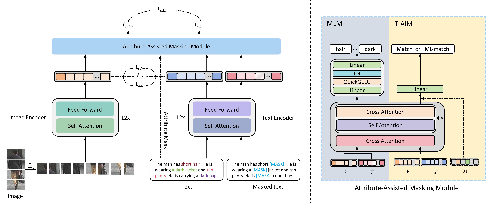

# A2TE: Enhancing Detail Awareness for Text-Based Person Search via Attribute Assistance and Token Exploitation
### The paper has been submitted to The Visual Computer. We sincerely appreciate your interest and support. The README will be further improved after acceptance.
## 1. Progect Overview
Text-based person search (TBPS) aims to retrieve pedestrian images from a large gallery using natural language descriptions. Although recent advances have led to notable improvements in retrieval performance, TBPS models still suffer from limited accuracy and suboptimal cross-modal alignment, as they often overlook fine-grained and discriminative details. To address these challenges, we propose Attribute Assistance and Token Exploitation (A\textsuperscript{2}TE), a novel approach to enhance detail awareness in TBPS. Specifically, the Attribute Assistance principle is embodied in the Attribute-Assisted Masking (A2M) module, which captures cross-modal contextual dependencies and guides the encoder to attend to discriminative local attributes. Meanwhile, the Token Exploitation principle is realized through the Detail-Aware Layer (DAL), which leverages attention maps to preserve fine-grained semantic cues and enhance locsal discriminability. The two modules jointly align visual and textual representations within a shared embedding space, substantially enhancing the model’s detail awareness. Experiments on three public benchmark datasets demonstrate that A\textsuperscript{2}TE consistently outperforms state-of-the-art methods in both fine-grained detail perception and retrieval performance.
## 2. Framework


## 3. Key algorithm
  **Attribute-Assisted Masking (A2M) module:** The module implicitly learns the correspondence between textual attributes and visual regions, enhancing the model’s sensitivity to fine-grained cues.  
    
   **Detail-Aware Layer (DAL) module:** The module fully exploits all token embeddings from large-scale vision–language models, enabling more precise and fine-grained alignment between pedestrian images and    textual descriptions.  
    
   **Freezing Strategy:** Freezing the CLIP convolutional layer as a fixed visual tokenizer, which stabilizes multi-loss optimization, preserves low-level priors, and improves convergence and generalization.  
    
## 4. Environment Setup
### Sofware Dependencies
```
Linux 6.8.0
Python 3.9.12
pytorch 2.6.0
torchvision 0.10.0
cuda 11.3
```
### Hardware Requirements
Nvidia L40 GPU with 48.00 GB
## 5. Installation and Usage
### Clone the repository
```bash
git clone https://github.com/junhaohe777/A2TE.git
```
### Prepare Datasets
Download the CUHK-PEDES dataset from [here](https://github.com/ShuangLI59/Person-Search-with-Natural-Language-Description), ICFG-PEDES dataset from [here](https://github.com/zifyloo/SSAN) and RSTPReid dataset form [here](https://github.com/NjtechCVLab/RSTPReid-Dataset)

Organize them in `your dataset root dir` folder as follows:
```
|-- your dataset root dir/
|   |-- <CUHK-PEDES>/
|       |-- imgs
|            |-- cam_a
|            |-- cam_b
|            |-- ...
|       |-- reid_raw.json
|
|   |-- <ICFG-PEDES>/
|       |-- imgs
|            |-- test
|            |-- train 
|       |-- ICFG_PEDES.json
|
|   |-- <RSTPReid>/
|       |-- imgs
|       |-- data_captions.json
```
### Training

```python
python train.py \
--name A2TE \
--img_aug \
--batch_size 64 \
--MLM \
--loss_names 'sdm+id+amm+detail' \
--dataset_name 'CUHK-PEDES' \
--root_dir 'your dataset root dir' \
--num_epoch 60
```

## 6. Text-to-Image Person Retrieval Results
#### CUHK-PEDES dataset -- [Model for CUHK-PEDES](https://drive.google.com/drive/folders/189OvVPHTEeMLbNFJFvTtFWjjBtkTxetS?usp=sharing)


#### ICFG-PEDES dataset -- [Model for ICFG-PEDES](https://drive.google.com/drive/folders/1XWVZjdou8gONb5Eg9cqU5DwZhZo_kbLW?usp=sharing)


#### RSTPReid dataset -- [Model for RSTPReid](https://drive.google.com/drive/folders/1-PLgCTqyK6tzZXPbLFiM1J6vJhNIv3g4?usp=sharing)


## 7. Acknowledgments
The code is based on [IRRA](https://github.com/anosorae/IRRA) licensed under Apache 2.0.

## 8. Citation
#### If you use this project's code,please cite our paper:
```bibtex
@article{He_2025_A2TE
  title={A2TE: Enhancing Detail Awareness for Text-Based Person Search via Attribute Assistance and Token Exploitation},
  author={He, Junhao and Zhang, Chengfang and Feng, Ziliang},
  journal={The Visual Computer},
  year={2025}
}
```
## 9. Contact Information
- **Email**: 2817881079@qq.com or chengfangzhang@scpolicec.edu.cn
